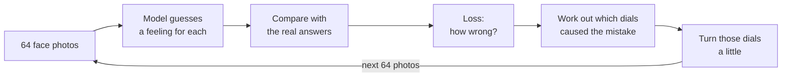
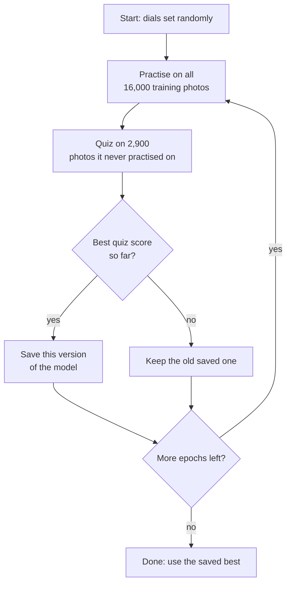
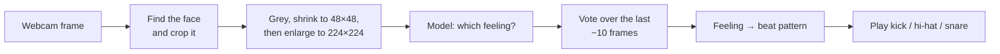

# Feynman Technique — Teaching a Computer to Read Faces

The Feynman Technique says you only really understand something once you can
explain it in simple words. It is a loop of four steps:

1. **Choose a tool or technology.** For me: training an image model with PyTorch.
2. **Do the research and the learning.** Fourteen training runs, from 10 to 11
   September, each one written down in `docs/experiments.md`.
3. **Teach it as if to a five-year-old.** That is this document. It follows
   the five steps from class: Explain, Model, Apply, Challenge, Transfer.
4. **Look for the gaps and go round again.** The last section lists what I
   still can't explain or haven't proven.

---

## 1. Explain — "What does it mean to train a model?"

Imagine teaching a child to recognise feelings using a big pile of flashcards.
Each card shows a face on the front, and the answer is on the back:
*angry*, *happy*, *neutral* or *surprised*.

- The child looks at a card and **guesses**.
- You flip the card over and tell them **how wrong** they were.
- The child **adjusts** their idea of what an angry face looks like, a little.
- Repeat, thousands of times.

That is training. The "child" is a **model**: a program full of millions of
small dials (called *weights*). At the start the dials are set randomly, so
the model guesses at random. Every wrong answer turns the dials slightly
towards the right answer.

A few words that come up a lot:

| Word | What it means in flashcard terms |
|---|---|
| **Dataset** | The pile of flashcards. I used FER2013: about 16,000 small black-and-white face photos for training. |
| **Loss** | A score for *how wrong* one guess was. Lower is better. |
| **Epoch** | Going through the whole pile once. |
| **Learning rate** | How much the child changes their mind after each mistake. Too little: slow. Too much: they overreact and never settle. |
| **Validation set** | About 2,900 cards the child **never practises on**. We only use them for quizzes, to check the child actually learned instead of memorising. |
| **Accuracy** | Out of the quiz cards, how many did it get right. |

The most important idea: **a model that memorises is not a model that
learns.** A child who memorised the answer on every card will fail as soon as
they see a new face. That is why the quiz cards are kept separate.

---

## 2. Model — "Draw what happens when it trains"

One training step, for one small stack of 64 photos:



One whole epoch, and why the quiz matters:



In code, the whole first picture is four lines inside `scripts/train.py`:

```python
logits = model(images)            # the model guesses
loss = criterion(logits, labels)  # how wrong was it?
loss.backward()                   # which dials caused the mistake?
optimizer.step()                  # turn those dials a little
```

(There is a fifth line, `optimizer.zero_grad()`, which wipes the notes from
the previous step so they don't pile up.)

---

## 3. Apply — "Use the model to explain what I actually did"

Using the flashcard picture, here is what each experiment taught me. Random
guessing between four feelings would score 25%.

| Run | What I changed | Quiz score | What it means, in plain words |
|---|---|---|---|
| 0 | A **tiny** model, built from scratch | 58.8% | The child is too small to hold the idea. It does just as badly on practice cards as on quiz cards. This is called *underfitting*. |
| 1 | Learning rate **10× bigger** | 37.3% | The child overreacts to every mistake and gets stuck. Barely better than guessing. |
| 2 | A **deeper** model from scratch | 67.8% | A bigger brain helps: +9 points. |
| 3 | **MobileNet, pretrained** | 81.3% | This model had already studied millions of ordinary photos (ImageNet). It knew about edges, shapes and eyes before it saw a single face. After one epoch it already beat run 2's final score. This is *transfer learning*. |
| 4 | **ResNet18, pretrained** | 79.7% | Seven times bigger than MobileNet, yet worse. It started memorising sooner. **Bigger is not automatically better.** |
| 5 | Smaller learning rate for MobileNet | 78.9% | I guessed the memorising came from a learning rate that was too big. **I was wrong**: it still memorised, only more slowly. A wrong guess ruled out is still something learned. |
| 6–7 | **Augmentation**: flip, tilt and brighten the photos randomly | ~81% | Every card now looks slightly different each time, so it's harder to memorise. It **delays** memorising, it doesn't stop it. |
| 8–10 | Different **optimizer**, **cosine** schedule, stronger **weight decay** | 83.7% | Cosine = big adjustments early on, tiny ones at the end. The score stopped jumping around and settled. |
| 11 | **Class weights** | 84.0% | There were 2.3 times more happy photos than surprised ones, so the model favoured "happy". Class weights make mistakes on rare feelings count more. The weakest feeling (angry) improved the most. |
| 12 | More **dropout** | 83.6% | Almost no effect. Also worth knowing. |
| 13 | **Label smoothing** | 83.9% | Teaches the model to never be 100% sure. Same score, but it became **honest**: it went from 181 wrong answers given with more than 90% confidence down to 56. |

**Run 13 is the final model**, because the app acts on how confident the
model is. A model that is confidently wrong would play the wrong beat.

And the same model, applied to the real product:



---

## 4. Challenge — "What happens when…?"

These are the questions that break a shallow understanding.

**…the model sees a face that isn't in the dataset, like mine through a MacBook webcam?**
Nobody knows yet, and that is the honest answer. 83.9% is the score on
FER2013 photos. Webcam lighting, camera angle and my own face are all new to
the model. It still has to be tested on real faces.

**…the webcam photo is sharp, but the training photos were blurry?**
The FER2013 photos are tiny (48×48) and were blown up to 224×224 for the
model, so they look soft. A webcam crop is sharp, and the model has never
seen a sharp face. So the app has to copy the exact same path: shrink to 48
first, *then* enlarge to 224. Skip that step and accuracy drops without any
error message.

**…the model isn't sure?**
The app only changes the beat when the model is at least 70% confident. When
it isn't, the current beat keeps playing. At 70%, about 83% of guesses get
through, and 90.6% of those are right.

**…the prediction flickers from frame to frame while I hold still?**
One photo can be misread. So the app takes a vote over the last few frames
and goes with the majority, the way you would trust five witnesses over one.

**…I change two things in the same run?**
Then I can't tell which one caused the result. That happened in run 3:
MobileNet changed the model *and* the photo size at the same time. I still
don't know how much of its win came from each.

**…I look at the final exam (the test set) early?**
Then I would start tuning towards it, and the final score would stop being
honest. The test set is opened once, at the very end.

---

## 5. Transfer — "How is the audio model different from the face model?"

The second model listens to a beatbox sound and says whether it is a *kick*,
*snare*, *hi-hat* or *clap*. The training loop is **exactly the same**:
guess, measure how wrong, adjust, repeat, quiz. What changes is everything
around it.

| | Face model | Audio model |
|---|---|---|
| Input | A photo | A short sound clip |
| How the model "sees" it | Pixels | A **spectrogram**: a picture of the sound, showing which pitches are loud at each moment. So an image model can be used for sound too. |
| Cleaning up | Grey, resize | Every clip converted to the same sample rate (22,050 Hz) and to mono |
| The trap when splitting practice cards from quiz cards | Split by photo | Split by **recording**. Each recording comes in many almost identical versions. If one version is in practice and another in the quiz, the model has already heard the answer. That is called a *leak*. |

The lesson that transfers to any future model: **the training loop is the
easy, reusable part. The hard part is the data**: how it is cleaned, how it is
split, and making sure the real world gives the model the same kind of input
it trained on.

---

## Gaps — what I can't explain yet (step 4 of the loop)

- **Real faces.** Everything so far is measured on FER2013. The webcam test
  has not happened yet.
- **The final exam.** The test set is still closed. 83.9% was used to *pick*
  the model, so it is slightly optimistic.
- **Memorising is still there.** Run 13 scores about 95% on practice photos
  and 84% on quiz photos. Nothing I tried closed that gap. Label smoothing
  changed *how* the model is wrong, not *how often*.
- **Model or photo size?** I still don't know how much of MobileNet's win
  comes from its pretraining and how much from the bigger 224×224 input.
  One run would settle it: the deeper scratch model at 224.
- **SGD** hasn't been tried as an optimizer.
- **The audio model** hasn't been trained yet. The Transfer section is my
  prediction of how it will go, and I will find out whether it holds.

Next pass through the loop: close these gaps, then explain this page again
to someone who has never trained a model.
