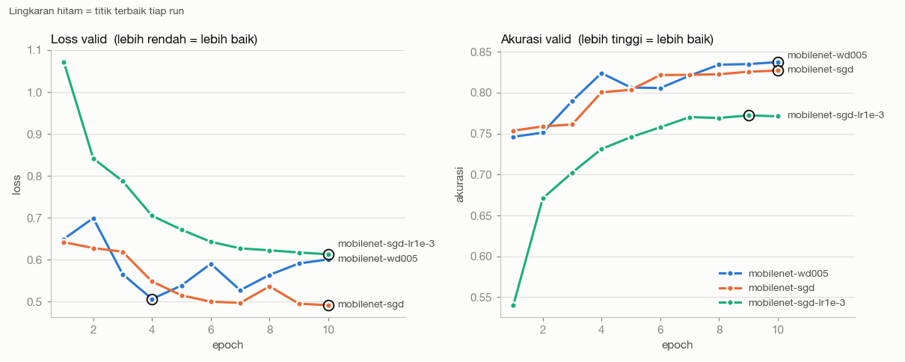

# Catatan Teknis — Emotion-to-Beatbox

Dokumen ini menjelaskan **apa yang dilatih, bagaimana, dan kenapa**: metode, setiap eksperimen beserta hasilnya, dan fungsi tiap file di `scripts/`. Angka mentah per run ada di [`experiments.md`](experiments.md); dokumen ini merangkum dan menjelaskannya.

> Status per 14 Sep: model wajah 5 kelas di-fine-tune dengan wajah yang direkam (**Fine-tune bersih jadi model final**) dan diuji di webcam. Test set belum dibuka (dijadwalkan sekali, Hari 8). Bagian yang masih menunggu hasil ditandai **⏳**.

---

## 1. Ringkasan

| | Model wajah | Model audio |
|---|---|---|
| Tugas | foto wajah → emosi | bunyi beatbox → kick / snare / hihat / clap |
| Data | FER2013 | Pafras/beatbox-bucket + AVP (uji lintas dataset) |
| Arsitektur final | MobileNetV3-Small pretrained (fine-tune) | AudioCNN (3 conv + BatchNorm), dari nol |
| Angka validasi | 0.839 (4 kelas) · 0.770 (5 kelas, +Sad) | 0.99 di bucket · ~0.57 di AVP (orang lain) |
| Dipakai di app? | **ya** — lewat Core ML | **tidak** — latihan kedua, hasilnya model card |

**Pelajaran utama:**
1. **Transfer learning mengalahkan training dari nol** dengan jauh (+12–13 poin), dan model lebih besar tidak otomatis lebih baik.
2. **Angka validasi yang tinggi belum tentu berarti model jalan di dunia nyata.** Model audio 0.997 di valid bucket jatuh ke 0.497 di suara orang lain; model wajah 0.839 di FER2013 membaca hampir semua ekspresi di webcam sebagai *neutral*. Dua-duanya ketahuan karena diuji di data dari kondisi berbeda, bukan hanya di valid set.
3. **Penyebab kegagalan dilacak dengan eksperimen terkontrol**, bukan ditebak — misalnya membuktikan model audio "curang" lewat padding nol.

---

## 2. Alur sistem — bagian mana yang ML

```text
Webcam ─► Vision (deteksi wajah) ─► crop ─► grayscale → 48×48 → 224×224 → normalisasi
      ─► MODEL WAJAH (Core ML) ─► probabilitas emosi
      ─► smoothing: voting ~10 frame + threshold keyakinan
      ─► lookup table: emosi → pola beat (mis. happy → K H H S K H H S)
      ─► audio engine: sampel kick/hihat/snare di jam BPM
```

Hanya **model wajah** yang merupakan ML hasil training. Deteksi wajah memakai Apple Vision (bawaan macOS). Pemetaan emosi → pola adalah tabel biasa, dan audio engine hanya memutar sampel. Keputusannya: **satu ekspresi memilih satu pola yang berulang**, bukan satu bunyi — karena smoothing saja butuh ~0.33 detik, sehingga "satu ekspresi = satu ketukan" terlalu lambat untuk jadi beat dan setiap prediksi yang goyang akan terdengar sebagai bunyi salah.

---

## 3. Metode umum (berlaku untuk dua model)

| Metode | Apa | Kenapa |
|---|---|---|
| **Training loop ditulis sendiri** | `run_epoch()` + `evaluate()` di `train.py`, tanpa `Trainer` | supaya setiap langkah (forward, loss, backward, step) terlihat dan dipahami |
| **Split train / valid / test yang dikunci** | seed 42, daftar file diurutkan sebelum diacak | run hanya bisa dibandingkan kalau datanya identik |
| **Test set dibuka sekali** | semua tuning memakai valid | kalau test dipakai berkali-kali untuk memilih, angkanya berhenti jujur |
| **One-factor-at-a-time (OFAT)** | tiap run hanya mengubah satu variabel dari run sebelumnya | setiap perubahan hasil bisa dijelaskan penyebabnya |
| **Cek pipeline sebelum training** | loss awal ≈ ln(jumlah kelas); model harus bisa menghafal 1 batch | model yang tidak bisa menghafal 32 contoh punya bug, bukan masalah setelan |
| **Patokan pembanding** | tebak acak, tebak kelas terbanyak, tebak dari durasi (audio) | tanpa patokan, angka tidak punya arti |
| **Metrik per kelas + confusion matrix** | bukan hanya akurasi total | akurasi total menyembunyikan kelas mana yang gagal dan ke mana kesalahannya |
| **Log setiap run** | satu run = satu baris di `experiments.md`, termasuk yang gagal | 20 run tanpa catatan = tidak ada yang dipelajari |

---

## 4. Model wajah

### 4.1 Data

- **FER2013**: foto wajah 48×48 grayscale, 7 emosi. Akurasi manusia di 7 kelas sekitar 0.65 — banyak foto memang ambigu (mis. neutral vs angry).
- **Kelas yang dipakai: angry, happy, neutral, surprise** (4 kelas). *Disgust* dibuang karena hanya 436 gambar (imbalance 16.5× → 2.28× setelah dibuang) dan sulit diperagakan sesuai permintaan. *Fear* juga tidak dipakai (alasannya tidak tercatat saat keputusan dibuat — datanya cukup, 4.097 gambar; dugaan: sulit diperagakan dan sering tertukar dengan surprise, belum diuji); *sad* diuji belakangan sebagai eksperimen tersendiri (lihat +Sad).
- **Split**: FER2013 hanya punya train dan test, jadi 15% train dijadikan valid, **diacak per kelas** (proporsi kelas train dan valid sama sampai 3 desimal). Hasil: train 16.444 · valid 2.902 · test 4.796. Ada assert bahwa tidak ada gambar yang masuk dua split.
- **Urutan kelas dikunci manual** — neuron output 0 berarti "angry" karena satu baris kode itu, dan Swift nanti harus memakai urutan yang sama.

### 4.2 Preprocessing

`grayscale 48×48 → resize 224×224 → ulang jadi 3 channel → normalisasi mean/std ImageNet`

Model pretrained dilatih di foto RGB 224×224, jadi input disesuaikan. Di webcam dan app, crop wajah **harus diperkecil ke 48 dulu** baru diperbesar ke 224 — model belajar dari foto FER yang diperbesar dan agak blur; crop webcam yang tajam langsung ke 224 adalah gambar yang tidak pernah ia lihat, dan akurasinya turun tanpa ada error.

### 4.3 Eksperimen

Semua run: seed 42, split sama. Detail per epoch di `experiments.md`.

**Bab 1 — Arsitektur** (lr 1e-3, Adam, batch 64, 5 epoch)

| Run | Parameter | Input | Val acc | Waktu | Catatan |
|---|---|---|---|---|---|
| TinyCNN (baseline) | 10 rb | 48 | 0.588 | 13 dtk | underfitting: train 0.597 ≈ valid |
| DeepCNN | 111 rb | 48 | 0.678 | 17 dtk | lebih dalam, +9 poin |
| **MobileNet** (pretrained) | 1,52 jt | 224 | **0.813** | 198 dtk | epoch 1 saja sudah melampaui DeepCNN |
| ResNet18 (pretrained) | 11,2 jt | 224 | 0.797 | 498 dtk | 7× lebih besar, tetap kalah |

→ **Transfer learning menang telak**: bobot ImageNet sudah "mengerti" bentuk dasar gambar. **Lebih besar ≠ lebih baik**: ResNet18 mulai menghafal lebih awal (loss valid terendah di epoch 2 vs 3).
→ *Belum bisa disimpulkan*: sebagian kemenangan pretrained mungkin datang dari ukuran input 224, bukan bobotnya — dua variabel berubah bersamaan. Run pemisahnya (DeepCNN di 224) belum sempat dijalankan.

**Bab 2 — Melawan overfitting** (MobileNet; tiap baris mengubah satu hal dari baris sebelumnya)

| Run | Yang diubah | Val acc | Hasil |
|---|---|---|---|
| LR kegedean *(di TinyCNN)* | lr 1e-3 → **1e-2** | 0.373 | macet: loss diam di ≈ ln 4, model tidak belajar sama sekali |
| LR kecil | lr 1e-3 → **1e-4** | 0.789 | overfit tetap, pola sama, hanya lebih lambat → lr bukan penyebabnya |
| Augmentasi | + flip, rotasi 10°, kecerahan/kontras | 0.809 | overfit **tertunda** (loss valid terendah pindah dari epoch 3 ke 5) |
| Augmentasi panjang | 5 → 15 epoch | 0.816 | plafon ~0.81; akurasi datar tapi loss naik = makin yakin pada jawaban salah |
| AdamW | Adam → **AdamW**, wd 0.01 | 0.817 | hampir identik — optimizer bukan tuasnya |
| Cosine | lr konstan → **cosine annealing** | 0.827 | goyangan antar epoch hilang |
| Weight decay | wd 0.01 → **0.05** | 0.837 | +1 poin, konsisten di 3 epoch terakhir |
| Class weight | + bobot kelas seimbang | 0.840 | kelas terlemah naik (angry 0.748 → 0.770); selisih terbaik–terburuk 16 → 11 poin |
| Dropout | dropout kepala 0.2 → **0.5** | 0.836 | tidak berpengaruh |
| SGD *(dari Weight decay)* | AdamW → **SGD + momentum 0.9**, lr 1e-2, wd 5e-4 | 0.827 | −1 poin, tapi hafalan jauh lebih sedikit (train 0.902 vs 0.954) dan loss valid tidak naik lagi |
| SGD lr kecil | lr 1e-2 → **1e-3** | 0.772 | underfitting (train ≈ valid): lr yang pas untuk Adam terlalu kecil untuk SGD |

**Bab 3 — Keyakinan**

| Run | Yang diubah | Val acc | Hasil |
|---|---|---|---|
| **Label smoothing ⭐** | target 1.0 → **0.925** (smoothing 0.1) | 0.839 | akurasi seri, tapi **salah-dengan-yakin->90% turun 181 → 56 foto**; loss valid tidak naik lagi |

**Bab 4 — Kelas**

| Run | Yang diubah | Val acc | Hasil |
|---|---|---|---|
| +Sad | 4 → **5 kelas** | 0.770 | sad 0.713, tapi neutral turun 0.813 → 0.679 dan angry 0.766 → 0.676 |

### 4.4 Perbandingan optimizer dan learning rate

| Setelan | Dicoba | Hasil |
|---|---|---|
| **Adam** | semua run awal | baseline |
| **AdamW** (weight decay terpisah dari gradien) | wd 0.01 dan 0.05 | seri dengan Adam di wd 0.01; wd 0.05 +1 poin |
| **SGD + momentum 0.9** | lr 1e-2 dan 1e-3, wd 5e-4 | lr 1e-2: **0.827** vs AdamW 0.837 — akurasi hampir sama, tapi train hanya 0.902 (AdamW 0.954) dan loss valid turun terus sampai epoch 10 (AdamW naik lagi sejak epoch 4). lr 1e-3: 0.772, underfitting |
| **LR (Adam)** | 1e-2 · 1e-3 · 1e-4 | 1e-2 terlalu besar (macet), 1e-4 terlalu lambat, 1e-3 paling baik |

**Kenapa SGD tidak diberi lr dan weight decay yang sama dengan AdamW:** Adam menyesuaikan ukuran langkah untuk tiap bobot, SGD tidak — SGD butuh lr sekitar 10× lebih besar. Di AdamW weight decay dipisah dari gradien; di SGD ia menyatu dengan gradien, jadi 0.05 akan terlalu kuat (angka standarnya 5e-4). Maka SGD dijalankan dengan resep standarnya sendiri, ditambah satu run dengan lr ala Adam untuk menunjukkan kenapa itu tidak adil.

**Yang terbaca:** optimizer adaptif (AdamW) mencapai akurasi sedikit lebih tinggi dan lebih cepat, tapi lebih cepat pula menghafal. SGD + momentum lebih lambat tapi generalisasinya lebih "tenang" — pola yang umum dilaporkan di literatur. Selisih 1 poin masih dalam goyangan satu seed, jadi AdamW tetap dipakai untuk model final.


| **Scheduler** | konstan vs cosine | cosine menghilangkan goyangan validasi (+1 poin) |

Catatan jujur: tiga nilai LR tidak semuanya diuji di model yang sama (1e-2 di TinyCNN, 1e-4 di MobileNet).

### 4.5 Model dasar: Label smoothing

> Ini model terbaik 4 kelas dan titik awal untuk +Sad. **Model final yang dipakai app adalah Fine-tune bersih** (bagian 4.7): +Sad yang di-fine-tune dengan wajah rekaman.

`MobileNetV3-Small pretrained · 224 · AdamW lr 1e-3 wd 0.05 · cosine · augmentasi · class weight · label smoothing 0.1 · 10 epoch · val 0.839`

**Kenapa Label smoothing, bukan Class weight** (akurasinya seri, 0.839 vs 0.840): di app, keyakinan model dipakai langsung — pola hanya berganti kalau model cukup yakin. Model Class weight sering yakin pada jawaban salah (181 salah dengan keyakinan >90%); Label smoothing hanya 56.

**Threshold keyakinan** (diukur di valid): 0.7 meloloskan 82.8% tebakan dengan akurasi 90.6%. Karena label smoothing, keyakinan model jarang di atas ~0.92, jadi threshold 0.9 hanya meloloskan sepertiga tebakan.

**+Sad** gagal kriteria yang ditetapkan *sebelum* run (neutral harus ≥ 0.78): sad mengambil kesalahan dari neutral (17.6% neutral ditebak sad) dan angry (17.7%). Meski begitu, **diputuskan memakai 5 kelas** agar app lebih variatif, dengan fine-tune sebagai upaya menutup kelemahan itu.

### 4.6 Uji di webcam

**Pipeline** (`webcam_test.py`): kamera → Apple Vision → crop → grayscale → 48 → transform training yang sama persis → model → smoothing. Deteksi wajah memakai Vision (detektor yang sama dengan app) supaya crop yang diukur sama dengan crop di app: 5.4 ms per frame.

**Temuan crop**: kotak Vision hanya 90% ukuran crop FER dan dimulai 10% lebih rendah — dahi terpotong, padahal ciri *angry* (alis berkerut) dan *surprise* (alis naik) ada di sana. Margin koreksi disiapkan untuk dibandingkan.

**Hasil (model Label smoothing, kamera MacBook)**: model **"menyerah" ke neutral**.

| Pose | Benar | Ditebak neutral |
|---|---|---|
| angry | 0.06 | 0.93 |
| happy | 0.08 | 0.84 |

83% frame angry lolos threshold 0.7 — model yakin tapi salah. **Pipeline bukan penyebabnya**: foto FER yang dilewatkan pipeline yang sama terbaca 0.62–0.95 per kelas. Yang berbeda hanya wajah dan kameranya → dasar keputusan **fine-tune**.

Masalah teknis yang ditemukan dan diperbaiki saat uji: OpenCV 5 tidak lagi punya detektor Haar (diganti Vision); *Continuity Camera* membuat macOS memakai kamera iPhone sebagai kamera 0; kamera terlalu rendah (wajah dari bawah).

**Uji ulang 14 Sep (model +Sad, kamera setinggi mata, sebagian besar wajah teman yang belum pernah dilihat model)** — membandingkan crop tanpa margin dengan margin `fer` (kotak diperlebar ke atas agar dahi dan alis ikut):

| | tanpa margin | margin `fer` |
|---|---|---|
| angry | 0.31 | **0.80** |
| surprise | 0.53 | **0.88** |
| happy | 0.98 | 0.86 |
| neutral | 1.00 | 0.86 |
| sad | 0.59 | 0.55 |
| rata-rata per pose | 0.683 | **0.787** |

Margin menaikkan persis kelas yang bergantung pada alis, sesuai hipotesis dari pengukuran kotak Vision. Margin `fer` dipakai untuk webcam, rekaman fine-tune, dan app. Sad tetap kelas terlemah dan keyakinannya jarang di atas 0.6 — alasan fine-tune tetap dijalankan.

### 4.7 Fine-tune dengan wajah sendiri ⏳

**Desain** (`record_faces.py` → `make_own_split.py` → `fine_tune.py`):
- Rekam beberapa orang (dengan izin), 5 ekspresi × 60 frame, maksimal 5 frame/detik supaya frame tidak kembar.
- **Split per orang**: satu orang tidak pernah ikut dilatih dan hanya dipakai untuk mengukur. Fine-tune hanya bernilai kalau membantu wajah yang belum pernah dilihat.
- Mulai dari model +Sad, **lr 1e-4** (sepersepuluh): menyesuaikan, bukan belajar ulang.
- Data latih = FER2013 **+** rekaman (diulang 10×). FER tetap dicampur supaya model tidak melupakan wajah lain (*catastrophic forgetting*).
- Diukur tiap epoch di dua tempat: orang yang tidak dilatih, dan FER valid. Epoch 0 = model sebelum fine-tune pada frame yang sama → perbandingan sebelum/sesudah yang jujur.

**Hasil** — direkam 7 orang (dengan izin); setelah dicek per frame, 2 orang dikeluarkan karena labelnya meragukan (tertawa saat diminta *sad*/*neutral*, *angry* yang nyaris datar). Latih: 4 orang, 1.200 crop. Validasi: 1 orang (erin).

| Run | Data rekaman | erin (terbaik) | erin sad | erin neutral | FER valid |
|---|---|---|---|---|---|
| sebelum (+Sad) | — | 0.660 | 0.35 | 0.80 | 0.770 |
| **Fine-tune bersih** | 4 orang, label bersih | **0.767** | **0.60** | 0.72 | 0.762 |
| Fine-tune semua | + 2 orang berlabel meragukan (+50% data) | 0.733 | 0.57 | **0.58** | 0.756 |

- Fine-tune menaikkan wajah yang tidak pernah dilatih **+10.7 poin**, terutama sad dan surprise, **tanpa melupakan FER** (0.770 → 0.762).
- **Label bersih mengalahkan jumlah data**: menambah dua orang berlabel meragukan (+50% data) justru menurunkan hasil, dan penurunannya jatuh tepat di *neutral* — kelas yang direkam sambil tertawa.
- **Uji live di wajah Pafras** (tidak pernah dilatih, dua model): seri secara total (0.71 vs 0.69). Tapi variasi cara berpose antar sesi lebih besar dari selisih antar model (sad di model yang sama: 0.98 di satu sesi, 0.29 di sesi lain), jadi uji live satu orang tidak cukup untuk membandingkan model. **Sad tetap kelas terlemah** di wajah baru.
- Threshold keyakinan 0.6 terlihat pas di webcam (±67% frame lolos, ±87% benar).

---

## 5. Model audio

### 5.1 Data dan split

- **Pafras/beatbox-bucket**: 5.058 clip train + 575 test, kelas clap / hihats / kick / snare. Tapi hanya **158 rekaman asli** — tiap rekaman punya ~32 varian hampir kembar (akhiran `-a-`, `-n-`, `-p-`, `-t-` di nama file; kemungkinan augmentasi bawaan dataset, tapi artinya tidak didokumentasikan).
- **Split per rekaman, bukan per file**: kalau satu varian masuk train dan kembarannya masuk valid, model dinilai pada bunyi yang praktis sudah ia dengar. 20% rekaman per kelas ke valid (clap hanya 19 rekaman; 15% akan menyisakan 3).
- **AVP (Amateur Vocal Percussion)**: 28 orang awam, mic bawaan MacBook Pro, 9.773 bunyi. Dipotong per onset, **split per orang**: 14 orang `avp-valid` (untuk membandingkan eksperimen), 14 orang `avp-test` (dibuka sekali). Tidak ada clap.

### 5.2 Fitur

Mono 22.050 Hz → potong/pad ke 0.5 detik → **log-mel spectrogram 64 × 44** (n_fft 1024, hop 256, top_db 80) → normalisasi dengan mean/std train. Spectrogram diperlakukan sebagai gambar grayscale 1 channel.

**Temuan sebelum training — panjang clip membocorkan label**: menebak kelas *hanya dari durasi* sudah mendapat 0.542 di valid (tebak kelas terbanyak 0.309). Semua hihat ≤ 0.28 detik, semua clap ≥ 0.29 detik. Angka ini jadi patokan: model yang hanya sampai ~0.55 belum tentu mendengar bunyinya.

### 5.3 Eksperimen

| Run | Yang diubah | avp-valid | bucket valid | Hasil |
|---|---|---|---|---|
| Patokan durasi | — | 0.229 | 0.542 | bocoran panjang tidak terbawa ke AVP |
| Baseline audio | AudioCNN, Adam 1e-3, 15 epoch | 0.497 | **0.997** | hanya 3 dari 1.044 clip salah di bucket |
| Baseline, diukur jujur | epoch terbaik dipilih dari AVP | 0.504 | 0.987 | angka per label sangat berisik antar epoch |
| Padding noise | padding nol → noise | 0.577 | 0.990 | +7 poin di AVP |
| **Padding noise (dibenerin) ⭐** | statistik normalisasi diperbaiki | 0.556 | 0.991 | seri → BatchNorm menyerap kesalahan tadi; **final** setelah uji 3 seed |
| Normalisasi volume | + normalisasi puncak | 0.576 | 0.976 | di seed 42 terlihat paling seimbang, tapi tidak terulang di 3 seed |

**Uji 3 seed** (sebelum test dibuka; rata-rata 5 epoch terakhir di avp-valid): Padding noise **0.506 ± 0.014**, Normalisasi volume **0.508 ± 0.058** — seri. Keunggulan "paling seimbang" Normalisasi volume ternyata kebetulan satu seed. Sesuai kriteria yang ditetapkan sebelum melihat hasil, dipilih yang kelas terlemahnya lebih tinggi dan lebih stabil: **Padding noise**. Test dinilai dengan ketiga seed (rata-rata ± simpangan), bukan seed terbaik.

**Temuan penting:**
- **0.997 hanya mengukur bucket.** Di AVP (orang lain, mic MacBook) angkanya 0.497, sedikit di atas menebak "hihats" terus (0.450).
- **Padding nol membuat model curang.** Bukti terkontrol: di clip valid bucket yang sama, mengganti padding nol dengan noise menjatuhkan recall hihat 0.991 → 0.502. Model belajar "bunyi pendek lalu hening digital = hihat", padahal mic sungguhan tidak pernah menghasilkan hening digital.
- **Kesalahan statistik normalisasi** (mean/std diukur saat padding nol, lalu dipakai untuk padding noise) ditemukan, diperbaiki, dan diuji ulang — hasilnya seri, jadi run sebelumnya tetap sah. Sekarang statistik dikunci per kombinasi pipeline dan dicek dengan assert.
- **Batas pengukuran**: skor per orang di avp-valid berkisar 0.45–0.78; dengan 14 orang, ketidakpastiannya **±0.055**. Selisih di bawah ~5 poin (mis. Padding noise vs Normalisasi volume) tidak bisa dibedakan.
- **Hihat hampir acak di AVP** (recall 0.38 dari 3 kelas): 44% hihat orang awam ditebak snare. Hipotesis "karena tiap orang menciptakan bunyinya sendiri" **terbukti salah** — rekaman dengan bunyi yang ditentukan peneliti justru lebih rendah (0.552 vs 0.593).
- **Kesimpulan**: masalahnya **keragaman data**, bukan setelan. 5.058 clip terlihat banyak, tapi hanya 158 rekaman dari segelintir performer bergaya bersih. Setelan (padding, statistik, volume) masing-masing hanya menggeser beberapa poin.

---

## 6. Penjelasan tiap file

### Data wajah
| File | Fungsi | Hal penting |
|---|---|---|
| `inspect_dataset.py` | hitung jumlah per kelas, rasio imbalance, dan render grid wajah untuk dicek mata | "label yang tidak bisa dibaca manusia, tidak bisa dibaca model" · punya `--selftest` |
| `make_split.py` | buat split train/valid dari FER2013, tulis ke CSV | seed 42, diacak per kelas, assert tidak ada tumpang tindih · `--with-sad` membuat split 5 kelas tanpa mengubah split 4 kelas |
| `show_batch.py` | `Dataset` FER2013, transform (resize, augmentasi, 3 channel, normalisasi), render satu batch | satu-satunya definisi preprocessing, dipakai training, evaluasi, dan webcam |

### Training dan evaluasi wajah
| File | Fungsi | Hal penting |
|---|---|---|
| `train.py` | training loop, semua arsitektur (TinyCNN, DeepCNN, ResNet18, MobileNet), optimizer, scheduler, class weight, dropout, label smoothing | config lewat argumen, jadi ganti setelan tidak perlu ubah kode · menyimpan checkpoint terbaik + grafik + JSON tiap run |
| `evaluate.py` | skor checkpoint di valid/test: loss, akurasi, recall per kelas, confusion matrix | memilih split dari daftar kelas di checkpoint |
| `predictions.py` | contoh prediksi benar/salah, satu contoh perhitungan loss, gambar confusion matrix | dipakai untuk membuka test set di Hari 8 |
| `plot_runs.py` | grafik loss/akurasi/lr per run, dan perbandingan beberapa run | tidak pernah pakai dua sumbu-y dalam satu grafik |

### Core ML
| File | Fungsi | Hal penting |
|---|---|---|
| `test_conversion.py` | membuktikan jalur PyTorch → Core ML pada CNN mainan sebelum ada model | beda ~1e-4 (float16), output diberi nama `logits` supaya Swift bisa memanggilnya |
| `check_coreml.py` | cek bahwa arsitektur sungguhan (MobileNetV3: hardswish, squeeze-excitation) terkonversi | float32 cocok ~1e-7, float16 ~1e-2 di logits (wajar untuk jaringan dalam) |

### Webcam dan fine-tune
| File | Fungsi | Hal penting |
|---|---|---|
| `face_detect.py` | deteksi wajah dengan Apple Vision dari Python | konversi koordinat Vision (0–1, titik nol kiri bawah) ke piksel OpenCV, dibuktikan dengan self-check |
| `webcam_test.py` | uji model live: pose ditandai dengan tombol, tiap frame dicatat, ringkasan per pose dan margin | menyimpan "gambar emas" untuk cek kesamaan hasil Python vs Swift di Hari 9 |
| `record_faces.py` | rekam wajah berlabel untuk fine-tune | menyimpan frame utuh + kotak, bukan crop, supaya margin bisa dipilih belakangan |
| `make_own_split.py` | crop rekaman persis seperti webcam, split per orang | orang di `--valid` tidak pernah dilatih |
| `fine_tune.py` | fine-tune dari model +Sad dengan FER + rekaman | ukur "sebelum" di epoch 0, simpan model asli kalau tidak ada perbaikan |

### Audio
| File | Fungsi | Hal penting |
|---|---|---|
| `audio_labels.py` | baca label dan nomor rekaman dari nama file | memakai `.stem`, bukan `.name` — kalau salah, file asli dan variannya terbaca sebagai rekaman berbeda dan split bocor |
| `make_audio_split.py` | split valid per rekaman | assert tidak ada rekaman di dua split |
| `make_avp_split.py` | potong rekaman panjang AVP per onset, split per orang | 30 ms pre-roll, berhenti di onset berikutnya |
| `audio_features.py` | clip → log-mel, `Dataset` audio | semua parameter dikunci; statistik normalisasi per pipeline |
| `train_audio.py` | AudioCNN, mode `--overfit`, training dengan dua valid (bucket + AVP) | memakai ulang loop dari `train.py` supaya angkanya setara |

### Lain-lain
`build_tracker.py` — membuat `tracker.html` dari `CHALLENGE.md` (alat bantu jadwal, bukan ML).

---

## 7. Pertanyaan yang mungkin ditanyakan

**Kenapa PyTorch, bukan Create ML?**
Create ML terlalu dekat dengan drag-and-drop: tidak ada desain arsitektur, training loop, atau eksplorasi hyperparameter. PyTorch dipilih (bukan TensorFlow) karena `coremltools` punya jalur konversi PyTorch yang didukung langsung oleh Apple.

**Apakah fine-tuning model pretrained masih dihitung "melatih model"?**
Ya, dan keduanya dibandingkan: TinyCNN dan DeepCNN dilatih dari nol, MobileNet dan ResNet18 dari bobot ImageNet. Hasil perbandingannya adalah salah satu temuan utama. Model audio dilatih sepenuhnya dari nol.

**Kenapa 0.84 sudah bagus?**
Manusia sekitar 0.65 di FER2013 7 kelas, dan tebakan acak 4 kelas 0.25. Tapi 0.84 tetap angka *valid* — test set belum dibuka, dan uji webcam menunjukkan angka valid tidak menjamin model jalan di wajah sungguhan.

**Kenapa MobileNet, bukan ResNet18?**
Lebih akurat (0.813 vs 0.797), 7× lebih kecil, 2.5× lebih cepat dilatih — dan harus berjalan real-time di app.

**Apa itu label smoothing dan kenapa dipakai?**
Target training diubah dari [1, 0, 0, 0] menjadi [0.925, 0.025, 0.025, 0.025], sehingga model tidak pernah diajari untuk 100% yakin. Akurasinya sama, tapi keyakinannya lebih jujur — penting karena app memakai keyakinan untuk memutuskan kapan pola berganti.

**Kenapa model audio 0.997 tidak dianggap berhasil?**
Karena 0.997 diukur di rekaman dari sumber yang sama. Di 14 orang lain dengan mic MacBook, hasilnya ~0.57. Angka yang jujur adalah angka di data dari kondisi yang berbeda.

**Kenapa hasil webcam jauh lebih buruk dari valid?**
Pergeseran domain: FER2013 adalah foto dari internet dengan sudut dan pencahayaan tertentu; webcam memberi sudut kamera, pencahayaan, dan wajah yang berbeda. Pipeline sudah dibuktikan benar, jadi solusinya ada di data (fine-tune), bukan di kode.

**Apa yang akan dilakukan kalau ada waktu lebih?**
DeepCNN di 224 (memisahkan efek ukuran input dari bobot pretrained); melatih model audio dengan sebagian orang AVP; menjalankan setiap konfigurasi dengan beberapa seed dan melaporkan rata-rata ± simpangan.

---

## 8. Batasan yang diketahui

- **Satu seed per run.** Selisih 1–2 poin antar run bisa jadi hanya kebetulan.
- **Epoch terbaik dipilih di set yang sama dengan yang dilaporkan**, jadi angka valid sedikit optimis. Angka jujur datang dari test set.
- **Test set belum dibuka.** ⏳
- **Belum dicoba**: augmentasi flip saja, DeepCNN di 224, melatih audio dengan data AVP.
- **Uji webcam dari satu wajah dan satu ruangan.** Fine-tune dan validasi dengan orang lain adalah langkah untuk mengatasinya. ⏳
- **Crop Python (Vision) vs Swift** belum dicek sama persis — "gambar emas" disimpan untuk dicek di Hari 9.
